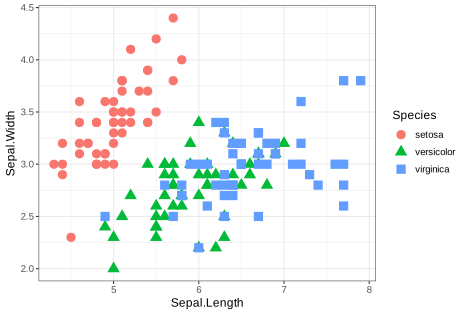
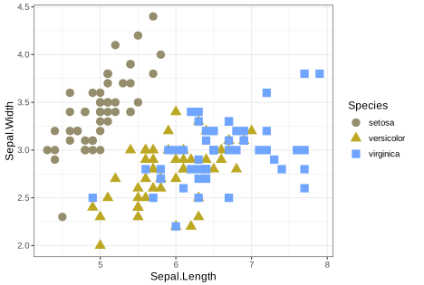
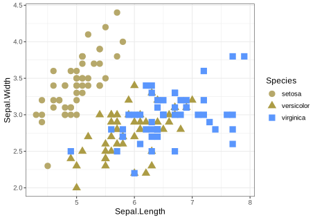
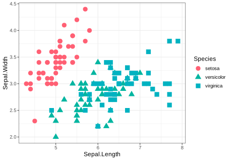
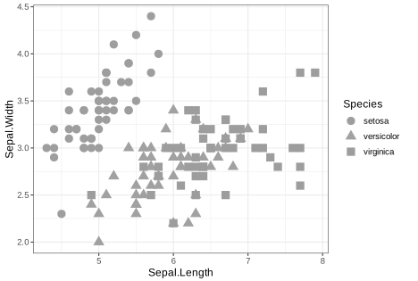
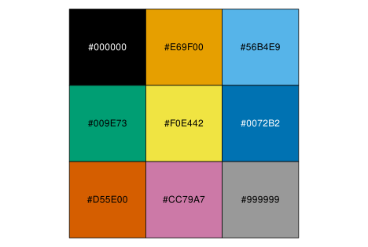

```{r setup, include=FALSE}
# Checks to see if pacman is installed. If no, it will install.
if(!require(pacman))install.packages("pacman")

pacman::p_load(learnr,
               ggplot2,
               extrafont)
knitr::opts_chunk$set(echo = FALSE, message = FALSE, warning = FALSE)

# Install and load Lato font
# font_import()
# fonts()
```


# R tutorial by Bradford Council HDRC Data Team

## Introduction

Welcome to this <code>R</code> course on getting started with data and visualisation.

This is a gentle introduction to working with data in <code>R</code> to produce plots like the one below.

```{r iris-final, include=TRUE}
ggplot(
  data = iris,
  mapping = aes(x = Sepal.Length,
                y = Sepal.Width,
                colour = Species,
                shape = Species,
                show.legend = FALSE)) +
  geom_point(size = 4) +
  labs(title = "Differences in sepal sizes of\nthree Iris species",
       x = "Sepal Length (cm)",
       y = "Sepal Width (cm)") +
  theme_bw() +
  theme(
    text = element_text(size=14,  family="Arial")
  )

```

There are exercises for you to complete which can be run in 'code chunks' like the one below. A code chunk is one or more lines of code that are grouped together as a 'chunk' and can be 'run'.

To run the code and see the output, select the blue 'Run Code' button on the right of the box. You should see another box appear below the code chunk with the phrase "Hello, World!".

```{r example, exercise=TRUE}
print("Hello, World!")
```

Important words will be highlighted in **bold** text, with definitions provided along the way to aid your learning.

The course will automatically save your progress when you close the program so that you do not have to repeat tasks you have already completed, and you can start over at any time by selecting the 'Start Over' option on the left side menu.

You can move forward or backward through the course by selecting the 'Previous Topic' or 'Next Topic' buttons below each section.

Let's get started!

## Learning objectives

In this tutorial you will carry out the following tasks:

1. Load one of <code>R</code>'s built-in datasets

2. Inspect the data and learn some terms to describe it

3. Try some of <code>R</code>'s plotting functions to create a scatter plot

<code>R</code> has several built-in datasets that can be used for practice. In this session, we will use the <code>iris</code> dataset containing measurements of the flower parts, petals and sepals, of three different *Iris* species.

The image below shows the three species and the flower parts used for the measurement data. [The original research from which the *Iris* data are taken was published by a famous statistician, R A Fisher, in 1936. If you wish to read more about the research, click this link to access the paper](https://onlinelibrary.wiley.com/doi/epdf/10.1111/j.1469-1809.1936.tb02137.x).

{width="100%"}
[Image obtained from Yong Cui, 2020](https://towardsdatascience.com/the-iris-dataset-a-little-bit-of-history-and-biology-fb4812f5a7b5)

The <code>iris</code> data are used in many examples you will encounter as you learn more about <code>R</code>.

The measurements taken of the petals and sepals can be displayed in a format like a table, called a **data frame**. **Data frames** are important objects in R and we will learn more about them as we start to work with them. For now, let's explore the <code>iris</code> data.

## Loading a dataset

### Exercise 1:

*Here is a simple exercise to view the built-in <code>iris</code> data.*

Click the 'Run code' button on the right side of the chunk to run the code and see the data.

```{r load-iris, exercise=TRUE}
iris
```

The dataset has 150 cases (rows) and 5 variables (columns). You can use the arrows and scroll bar to the right of the window that has appeared to view all of the data.

You might see that there are six columns in the data. The first column shows the row number for each 'case', which is typically not included in analysis. The actual data columns are named Sepal.Length, Sepal.Width, Petal.Length, Petal.Width, and Species.

Notice that the first row of data is labelled as number 1. The row containing the column titles is not counted as a row.

In some programming languages the first row of data starts at 0 (zero), which is an important thing to remember if you have experience of coding in other languages that start counting at 0, or decide to learn others once you feel confident working with <code>R</code>.

## Inspecting the data

The <code>iris</code> dataset has 150 rows that can be easily viewed in the output pane below the code chunk, but what if your dataset has 1,000 rows, 10,000 rows, or more, with many more columns?

It is not convenient to show all the data this way, and at the beginning of a piece of analysis it is often helpful to see a small subset of the data.

<code>R</code> has many useful commands (or **functions**) to help with this.

### Exercise 1

One such **function** is <code>head</code>, which shows the first 6 rows of a dataset, and the column headings.

To use this built-in **function**, type its name and enclose the name of the dataset in parentheses '()'.

This has been done for you below, and you can run the code to see the output.

```{r head-iris, exercise=TRUE}
head(iris)
```

It is the same information as you saw if you ran the code in the previous screen, but just the top 6 lines - just enough to begin to see what the data look like.

Ignoring the first column (with the row numbers), the next four columns show measurements in centimeters of the **variables** sepal length and width, and petal length and width of *Iris setosa*.

The columns for sepal length and width, and petal length and width are **numeric** data containing numbers with a decimal point. The species column is **categorical**, with three different categories.

### Exercise 2

<code>R</code> has a complementary function to the <code>head</code> function you just ran. It is called <code>tail</code> and it shows the last 6 rows of the data instead of the first 6 rows.

Run the code chunk below to see the result.

```{r tail-iris, exercise=TRUE}
tail(iris)
```

### Exercise 3

There are other built-in functions that can be used to inspect your data:

- <code>names</code> will show you all the column names in your dataset

- <code>dim</code> will show you the dimensions of your data as the number of rows and the number columns

- <code>summary</code> will provide basic descriptive statistics for data that are stored as numbers

The first one, <code>names</code>, has been done for you so you can click the "Run Code" button to see the output.

Try running each of the other functions with the <code>iris</code> dataset to see what the outputs look like.


```{r inspecting-iris, exercise=TRUE}
names(iris)
```

With the <code>summary</code> function, the first four columns will show descriptive statistics for each of the **variables**: Min, 1st quartile, Median, Mean, 3rd Quartile and Max.

The Species column shows the three species for which measurements have been taken, and the total number of measurements per species, which is 50.

Missing data in <code>R</code> is coded as 'NA'. The <code>summary</code> function will show the total number of NAs in your data. The data used here have no missing variables, so we can go ahead and start creating our first plot.

## Visualising the data

Just by looking at the data summaries it is not obvious if there is a difference in the sizes of sepals and petals between each of the three *Iris* species.

Now, let's create a simple **scatter plot** to visualize the relationship between the Sepal Length and Sepal Width of the iris flowers to start, using the package <code>ggplot2</code>, which has already been installed.

A **scatter plot** uses dots or points to represent values for two different **numeric variables** (numbers). The position of each point on the horizontal (x) axis and vertical (y) axis indicates values for each individual. To illustrate this point, we will create a scatter plot with the values for sepal length on the horizontal (x) axis and sepal width on the vertical (y) axis.

Run the code below to have a quick look at a basic scatter plot.

```{r scatterplot, exercise=TRUE}
ggplot(
  data = iris,
  mapping = aes(x = Sepal.Length,
                y = Sepal.Width)) +
  geom_point()
```

Let's break down the code above to find out what is happening.

<code>ggplot</code> calls the function for creating a plot.

<code>data = iris</code> tells <code>R</code> which dataset to use. The comma at the end of the line is important because it tells <code>R</code> to interpret this piece of code as complete and to move on to the next piece of code.

<code>mapping = aes(x = Sepal.Length,
                    y = Sepal.Width)</code> provides instructions for creating the plot **aesthetics**. Here the variables for creating the scatter plot are specified. Again, there is a comma after the instruction for specifying the <code>x</code> variable.

<code>geom_point()</code> tells <code>R</code> that we want to use points to represent each pair of variables in the dataset.

<code>ggplot</code> uses **layers** to create plots, which means you can control many plot features. The way it does this is with the plus ('+') symbol. We will see other types of **layers** later in this course.

Are you able to see whether the three species are different based on their sepal lengths and widths?

It is ok if you can't as we don't know which points belong to which species based on the current plot. In the next section we will tweak the scatter plot to make it easier to identify each species.

## Improving the scatter plot

When you run the code chunk below you will see that the scatterplot is the same as the one created in the previous section. We are going to change the **aesthetics** of the points using the <code>aes</code> function. Currently there are two **attributes** inside the <code>aes</code> function: variables assigned to the horizontal x-axis (Sepal.Length) and the vertical y-axis (Sepal.Width).

```{r scatterplot2, exercise=TRUE}
ggplot(
  data = iris,
  mapping = aes(x = Sepal.Length,
                y = Sepal.Width)) +
  geom_point()
```

### Example 1

Although the points on the scatterplot are based on numeric values (measurements, which are **quantitative data**), they are taken from three different species (**qualitative data**). There is no particular order to the data, but it may be appropriate to use colours to help identify any groups.

To change the colours of the points, we use the <code>colour</code> argument, as shown below, and specify the colours by Species.

```{r scatterplot3, exercise=TRUE}
ggplot(
  data = iris,
  mapping = aes(x = Sepal.Length,
                y = Sepal.Width,
                colour = Species)) +
  geom_point()
```

Notice the difference between the two plots. The points now have colours according to species and a **legend** has been added to the right side of the plot showing the colours used for each species.

### Exercise 1

The shape and size of the points can also be changed, using the <code>shape</code> argument for shapes with the 'Species' variable, and <code>size</code> for size.

See if you can alter the code chunk below to change the shape of the points for each species.

Then have a go at changing the size of the points. Set <code>size = 4</code> and notice the change. Try different numbers.

If you are stuck, use the 'Hints' button at the top of the code chunk to see two hints, and the final solution.

```{r shape, exercise=TRUE}
ggplot(
  data = iris,
  mapping = aes(x = Sepal.Length,
                y = Sepal.Width,
                colour = Species)) +
  geom_point()
```


```{r shape-hint-1}
ggplot(
  data = iris,
  mapping = aes(x = Sepal.Length,
                y = Sepal.Width,
                colour = Species,
                shape = Species)) +
  geom_point()
```


```{r shape-hint-2}
ggplot(
  data = iris,
  mapping = aes(x = Sepal.Length,
                y = Sepal.Width,
                colour = Species,
                shape = Species,
                size = )) +
  geom_point()
```


```{r shape-solution, exercise.reveal_solution = TRUE}
ggplot(
  data = iris,
  mapping = aes(x = Sepal.Length,
                y = Sepal.Width,
                colour = Species,
                shape = Species,
                size = 4)) +
  geom_point()
```

Based on the sepal widths and lengths, you may be able to detect a group of *Iris setosa* (pink circles), with the two other species, *Iris versicolor* (green triangles) and *Iris virginica* (blue squares) overlapping.

### Exercise 2

Try using the other variables of petal length and petal width for the horizontal x-axis and vertical y-axis values to see if you can identify one or more distinct clusters. Use the code chunk below to type your own code and then answer the quiz question below to check your answer.

Don't forget to use the 'Hints' button if you get stuck. There are 3 hints and the final solution.

```{r petals, exercise.lines = 10, exercise = TRUE}

```


```{r petals-hint-1}
ggplot(
  data = iris,
  mapping = aes( 
                 
                ))
```


```{r petals-hint-2}
ggplot(
  data = iris,
  mapping = aes(x = Petal.Length,
                y = Petal.Width
                )) +
  geom_point()
```


```{r petals-hint-3}
ggplot(
  data = iris,
  mapping = aes(x = Petal.Length,
                y = Petal.Width,
                colour = Species)) +
  geom_point()
```


```{r petals-solution, exercise.reveal_solution = TRUE}
ggplot(
  data = iris,
  mapping = aes(x = Petal.Length,
                y = Petal.Width,
                colour = Species,
                shape = Species,
                size = 4)) +
  geom_point()
```


```{r petalquiz}
quiz(
  question("Which *Iris* species is in a group by itself?",
    answer("setosa", correct = TRUE),
    answer("versicolor"),
    answer("virginica")
  ))
```

## Finishing the plot

There are still some things we can do to make the plot look nicer. If you followed the tutorial steps you might have noticed a second legend appearing on the chart with the number 4. If not, run the code chunk below and you will see two legends appearing to the right of the scatter plot.


```{r scatterplot4, exercise = TRUE}
ggplot(
  data = iris,
  mapping = aes(x = Sepal.Length,
                y = Sepal.Width,
                colour = Species,
                shape = Species,
                size = 4)) +
  geom_point()
```

### Exercise 1

We are now going to:

- Remove the additional legend that has appeared with the number 4

- Increase the size of the text and symbols in the legend we want to keep

To remove the extra legend from the right of the plot, the solution is to move <code>size = 4</code> from <code>mapping = aes()</code> and add it to <code>geom_point()</code>

Try that now. Use a hint if you get stuck.

```{r legend, exercise = TRUE}
ggplot(
  data = iris,
  mapping = aes(x = Sepal.Length,
                y = Sepal.Width,
                colour = Species,
                shape = Species,
                size = 4)) +
  geom_point()

```


```{r legend-hint-1}
ggplot(
  data = iris,
  mapping = aes(x = Sepal.Length,
                y = Sepal.Width,
                colour = Species,
                shape = Species)) +
  geom_point(size = )

```


```{r legend-solution, exercise.reveal_solution = TRUE}
ggplot(
  data = iris,
  mapping = aes(x = Sepal.Length,
                y = Sepal.Width,
                colour = Species,
                shape = Species)) +
  geom_point(size = 4)

```


### Exercise 2

The next two things to do are:

- Tidy the x and y axis labels

- Add a title

For improving accessibility, titles should be added to the body of the page or document. For the purpose of this tutorial, the title is included within the code to show you how to do it.

The x and y axis labels can be changed easily using the <code>labs</code> function.

The attributes to change in the code below are <code>title</code>, <code>x</code> and <code>y</code>.

To use it, an extra **layer** for labels is added to the code with a plus ('+') sign. See the code below and add some labels of your own.

It is good practice to add the units of measurement to the x- and y- axis labels, which in this case is centimeters (cm).

```{r iris-labels, exercise = TRUE}
ggplot(
  data = iris,
  mapping = aes(x = Sepal.Length,
                y = Sepal.Width,
                colour = Species,
                shape = Species,
                show.legend = FALSE)) +
  geom_point(size = 4) +
  labs(title = "Differences in floral attributes of three Iris species",
       x = "x-axis label here",
       y = "y-axis label here")

```

### Exercise 3

Just to demonstrate some of the additional customisations available with <code>ggplot</code>, we are going to make a couple more changes:

- Remove the background

- Use a custom font and change the font size

For this, <code>ggplot</code> has a **theme** system that controls the look and styling of a plot.

In the same way as for <code>geom_point()</code> and <code>labs()</code>, the <code>theme()</code> is a **layer**, specified with a plus ('+') symbol.

Many different **themes** are available to use. A simple one to start with is <code>theme_bw()</code>. This removes the basic formatting of the plot. Run the code below to see how it works.

```{r iris-final1, exercise = TRUE}
ggplot(
  data = iris,
  mapping = aes(x = Sepal.Length,
                y = Sepal.Width,
                colour = Species,
                shape = Species,
                show.legend = FALSE)) +
  geom_point(size = 4) +
  labs(title = "Differences in floral attributes of three Iris species",
       x = "Sepal Length (cm)",
       y = "Sepal Width (cm)") +
  theme_bw()

```

The grey background has been removed and there is now a border around the plot. As you progress in your knowledge of <code>ggplot</code> you can change many of these features with different themes.

Let's have a go at changing the font type to "Courier", and the font size to 10.

This can be achieved by adding an additional <code>theme</code> layer and changing the <code>text</code> attribute - see the example below.


```{r iris-final2, exercise = TRUE}
ggplot(
  data = iris,
  mapping = aes(x = Sepal.Length,
                y = Sepal.Width,
                colour = Species,
                shape = Species,
                show.legend = FALSE)) +
  geom_point(size = 4) +
  labs(title = "Differences in floral attributes of three Iris species",
       x = "Sepal Length (cm)",
       y = "Sepal Width (cm)") +
  theme_bw() +
  theme(
    text = element_text(size = 10,
                        family = "Arial")
  )

```

Try changing the font and font size. <code>R</code> will be able to use many system fonts installed on your device. You can also add more fonts yourself and make them available for <code>R</code> to use, but this can be a bit tricky and is not covered in this tutorial.

## Accessibility

The main purpose of a chart is to present complex information in a way that makes it easier for people to understand important messages about data. Making something accessible means designing a product or service in such a way that people are not excluded from using it due to a disability or impairment.

For websites and digital content, there are [Web Content Accessibility Guidelines that provide a lot of detail about things you can do to make websites accessible](https://www.w3.org/WAI/standards-guidelines/wcag/). [A more concise and easy to read version of this document, 13 Days of Accessibility,](http://a11ycalendar.kaseybon.com/) presents an overview of the main concepts.

However, it may not be easy at all for some people to engage with charts and diagrams if they have colour vision deficiency (colour blindness), or are partially-sighted or blind.

Since September 2018 it has been a legal requirement for public sector organisation websites and apps to meet accessibility standards and publish an accessibility statement. This applies to intranet and extranet sites as well.

### Colour vision deficiency

In the UK, colour blindness affects approximately 1 in 12 men (8%) and 1 in 200 women (0.5%).

A person with colour blindness sees colours differently to people who do not have colour blindness. There are several different types that are categorised on basis of which colours can be detected by the eyes. These are:

- Protanopia (red-blind): no shades of red can be seen.
- Protanomaly (red-weak): some shades of red may be seen.
- Deuteranopia (green-blind): no shades of green can be seen.
- Deuteranomaly (green-weak): some shades of green may be seen.
- Tritanopia (blue-blind): no shades of blue can be seen.
- Tritanomaly (blue-weak): some shades of blue may be seen.

Some people may not be able to see any colour at all. This is know as monochromacy (achromatopsia). For this type of colour blindness, the world appears in shades of grey.

For each type of colour blindness, the severity may vary for each person.

Whilst colour blindness is more common in men, there is a type of colour vision found in approximately 12% of women, known as tetrachromacy, or "super colour vision" that enables them to see many more colours than the rest of the population.

[For more information about colour vision deficiency, see the website of UK charity Colour Blind Awareness](https://www.colourblindawareness.org/).

Choosing appropriate colours to meet the needs of people with different types of colour vision can be challenging, but help is at hand! There are many colour palettes that are suitable to use for the different types of colour blindness that occur.

Let's have a look at our *Iris* plot again, and simulate colour vision for red-weak (protanomaly), green-weak (deuteranomaly), blue-weak (tritanomaly), and shades of grey (monochromacy). The severity for each type has been set to 'moderate', so it may be more or less severe depending on the person.

## Accessibility: colour blindness

Here is the plot for people without colour blindness. It is possible to see that *setosa* is mostly in a group by itself (with one stray point), whilst *versicolor* and *virginica* overlap quite a lot. The use of colour and shape may be OK for sighted people with no colour blindness.

{width="100%"}

Here are the plots for the different types of colour blindness.

This first one shows red-weak vision (protanomaly). At this level of severity (moderate) it is possible to see the three different groups using the original colour choices. However, for someone with red-blindness (protanopia) it might not be possible to tell the difference.

{width="100%"}

This second one shows green-weak vision (deuteranomaly). Based on colour alone, it is not easy to see the difference between the species *setosa* and *versicolor*. For people with green-blindness (deuteranopia) it will be impossible to tell these colours apart. Fortunately the use of different shapes helps to see the three species on the plot.

{width="100%"}

This third image shows blue-weak vision (tritanomaly). It is quite difficult to see the green and blue colours used for *versicolor* and *virginica*, even with the use of different shapes because there are many points where the two species overlap.

{width="100%"}

And finally, grey scale (monochromacy). With this type of vision, the use of colour is no help at all. In fact, if it were not for the shapes, it would be impossible to see any distinct groups.

{width="100%"}
What can we do?

Well the first thing to think about is whether you need to use colour at all. This will depend on your data and what you are trying to show. If possible, try to keep your visualisations as simple as possible, and only use colour if it really aids interpretation.

If you decide that you need colour, <code>R</code> has many colour blind-friendly palettes from which to choose.

The one demonstrated here was designed by two researchers from Japan, Dr Masataka Okabe and Dr Kei Ito, both with red-blindness (protanopia). [You can learn more about Okabe and Ito's work on colour blindness by reading their paper, "Color Universal Design - How to make figures and presentations that are friendly to Colorblind people"](http://jfly.iam.u-tokyo.ac.jp/color/).

The palette has 8 colours, which can be seen below with their 'hex codes'. Hex codes are hexadecimal colour codes made up of 6 digits (letters and/ or numbers) and are preceded by the hash '#' symbol. They play an important role in web design as they are interpreted by computers and represented as different colours depending on the combination of digits.

{width="100%"}

Using our <code>ggplot</code> code from the exercises in this tutorial, you can play with the colours on the scatterplot to test the combinations.

Look at the code below. It is almost the same as in the last exercise you did, except for two changes:

1. the title has been removed.

2. a line of code has been inserted below <code>geom_point</code>.

To change the colours used in the scatterplot with this palette you need to manually state the colours you want in the line of code <code>scale_color_manual(values = c("#E69F00", "#009E73", "#CC79A7"))</code>.

This part has been done for you, so you can just run the code to see the plot.

Now have a go at changing the hex codes to different colours. You can copy and paste from this list of Okabe-Ito hex codes (don't forget to enclose the hex codes in quotation marks):

Black - #000000

Orange - #E69F00

Sky blue - #56B4E9

Bluish green - #009E73

Yellow - #F0E442

Blue - #0072B2

Vermillion - #D55E00

Reddish purple - #CC79A7

Grey - #999999

```{r iris-OkabeIto, exercise = TRUE}
ggplot(
  data = iris,
  mapping = aes(x = Sepal.Length,
                y = Sepal.Width,
                colour = Species,
                shape = Species,
                show.legend = FALSE)) +
  geom_point(size = 4) +
  scale_color_manual(values = c("#E69F00", "#009E73", "#CC79A7")) +
  theme_bw() +
  theme(
    text = element_text(size = 12,
                        family = "Arial")
  )

```

There are many resources for creating colour blind-friendly visualisations in <code>R</code>.

[More information about accessible charts can be found in the Guidance Hub of the Government Analysis Function, Data visualisation: charts](https://analysisfunction.civilservice.gov.uk/policy-store/data-visualisation-charts/).

[Guidance for colours can be found in the Gudance Hub under Data visualisation: colours](https://analysisfunction.civilservice.gov.uk/policy-store/data-visualisation-colours-in-charts/).

Next we will delve into things you can do to improve accessibility for people using screen and braille readers.

## Accessibility for screen and braille readers.

Assistive technologies, such as screen readers and braille conversion devices, 'read' and convert digital content for people who use these devices. However, it is important to ensure that such content is structured and labelled properly to make it accessible.

Here are some things you can do.

### Alternative text (alt text).

Alternative text (or alt text) can be added to images and charts on websites and documents in HTML format to provide a description and context to people using devices like screen readers that convert to speech or braille. Alt text also refers to any text that describes non-text content. This can be a description of the chart (or image), or a table of the data presented in a chart.

[The UK charity, the Royal National Institute for Blind People (RNIB) has created useful guidance for adding alt text to images](https://www.rnib.org.uk/campaign-with-us/alt-text-campaign/how-can-i-write-alt-text/).

The main guidelines are:

1. Be descriptive

2. Keep it concise

3. Use keywords

4. Contextualise

5. Avoid redundancy

6. Use punctuation sparingly

An example of bad and good alt text for an image of the cat in the image below may be:

Bad alt text: "Cat"

Good alt text: "A pale kitten with blue eyes is lying outstretched on a grey blanket facing the camera."

{width="80%"}

For more complex images, such as charts, the alt text should include a description of the chart type, data type(s) and a summary of what the chart shows.

[A excellent blog post has been written by Amy Casel who provides the following template: alt = "[chart type] of [data type(s)] where [reason for including chart]."](https://nightingaledvs.com/writing-alt-text-for-data-visualization/)

For our scatterplot we could say: "Scatterplot comparing sepal length and width of three *Iris* species and showing two main clusters".

You can add more information in the main text body, including describing any categories, axis information (X and Y), and summary statistics such as minimum and maximum values, means, medians, and anything else important to aid understanding.

It is also appropriate to provide an alternative format for datasets, such as a data table in CSV or ODS format. The table should be made with correct markup for headings and column names.

[Examples of how to structure accessible tables can be found in the Guidance Hub of the Government Analysis Function, Data visualisation: tables](https://analysisfunction.civilservice.gov.uk/policy-store/data-visualisation-tables/).

## Congratulations!

Well done for reaching the end of this tutorial. We have covered several important topics and worked through some code.

The best way to improve is to keep practising the things you have learned and repeat sections to become more familiar with the terms and structure of the code. A glossary of key words is available at the end of the quiz.

You should also be able to use this code in RStudio if you would like to try it there.

To finish off, a final quiz to check your learning:


```{r quiz2}
quiz(
  question("Which package has been used in this tutorial for creating plots?",
    answer("base"),
    answer("stats"),
    answer("ggplot2", correct = TRUE),
    answer("codetools")
  ),
  question("Which attribute is used to change the size of a point",
    answer("size", correct = TRUE),
    answer("mapping"),
    answer("shape"),
    answer("colour")
  ),
  question("Which two functions can be used to quickly inspect a dataset and its variables?",
           answer("aes"),
           answer("head", correct = TRUE),
           answer("dim", correct = TRUE),
           answer("theme")
           )
)
```

### Glossary of important terms

**Aesthetics** - parameters you can change to alter the appearance of a plot, such as colour, shape, size.

**Attributes** - additional parameters in functions that can be used to modify datasets and plots, for example chart titles.

**Categorical** - data that are organised into groups (or categories) based on qualitative characterstics, such as *Iris* species.

**Data frame** - data displayed in a format like a table.

**Function** - a set of instructions that or commands that perform a specific task on a dataset or plot.

**Layers** - in <code>ggplot</code>, the attributes and aesthetics can be changed with the use of layers, such as <code>labs</code>.

**Legend** - a guide on a chart to help a viewer understand more complicated plots, such as the different clusters of *Iris* species.

**Numeric** - a type of data that is expressed as a number or group of numbers.

**Qualitative data** - data that are non-numerical (text, words, images, sounds) and may be descriptive in some way, or refer to characteristics such as colour, species, emotions, opinions.

**Quantitative data** - numerical data that can be analysed with various statistical methods to identify patterns and trends for generating insights.

**Theme** - <code>ggplot</code> options for customising the appearance of a plot, such as fonts and background colour.

**Variables** - a characteristic of interest that you want to measure or analyse, such as the sepal and petal sizes in the *Iris* dataset.